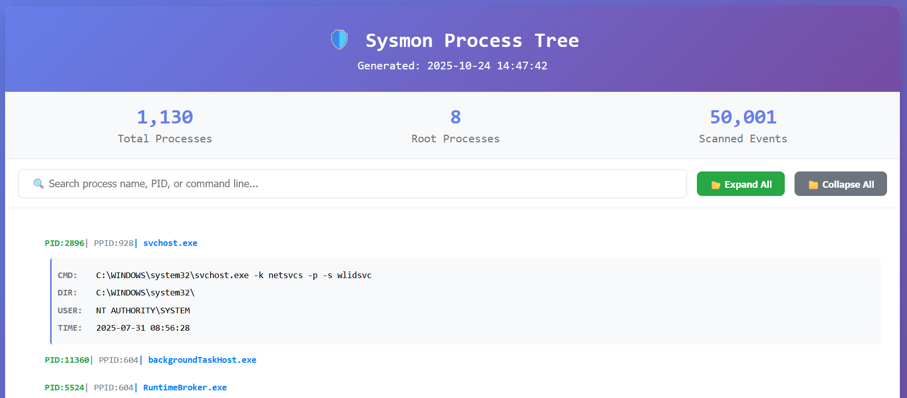

# Sysmon Process Tree Analyzer

A lightweight Python tool to parse **Windows Sysmon EVTX** logs and visualize **process creation (EventID=1)** events as an interactive process tree.

This project was originally developed to handle the challenge of **Offsec Proving Grounds: The Gauntlet – Echo Response**,  where detailed Sysmon analysis was required to reconstruct process behaviors and trace malicious execution chains.

---

##  Features
- Extracts **Sysmon EventID=1** (Process Creation)
- Builds **parent–child process trees**
- Generates an **interactive HTML report**
- Supports **search**, **expand/collapse**, and **summary statistics**

---

##  Installation

```bash
git clone https://github.com/deadbeesec/sysmon-pstree.git
cd sysmon-pstree
pip install -r requirements.txt
```

##  Usage
# Basic usage
```bash
python sysmon2tree.py sysmon.evtx --html report.html
```

# Limit events for faster parsing
```bash
python sysmon2tree.py "D:\sec\ctf\test.evtx" --max-events 50000 --html report.html
```

## Requirements
- Python 3.7+
- python-evtx

## Preview
Below is an example of the generated interactive HTML process tree:




